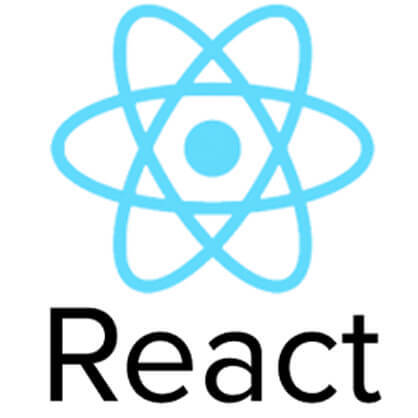
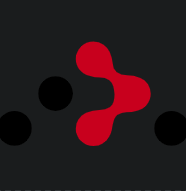
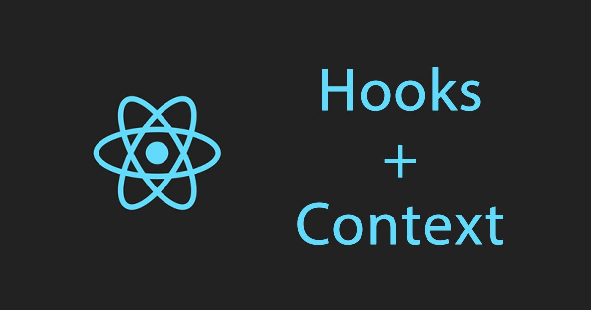

# Head to Toe
#### Connecting you with gender-affirming support

  

## Table of Contents
* [Description](#description)
* [Installation](#installation)
* [Walkthrough](#walkthrough)
* [Authors](#authors)
* [Technologies](#technologies)

## Description

This app is the brain child of so many of us looking for someone that accepts us where we are, and has the qualified skills to help us heal, or find ourselves at home in our bodies again.

We work together as a team of front end and back end stack developers putting the needs of our users first.

## Notable Features

* A warm welcome using font and color-scheming that is inclusive
* Navigation to a list of queer-informed mental health Professionals and gender-educated doctors
* A form to help contribute to our pool of resources
* Light and dark mode viewing with the click of a button
* Cypress testing to test user flows
* Responsive design, lighthouse, color picker and font were all used to maintain accessibility; Our app can be used on all screen sizes with considerations for tabbing, color choices, and button sizing for ease of UX
* Circle CI for build automation, testing and deployment of the app

## Link
* We are [Published](https://HeadToToe.surge.sh)

## Installation
1. Clone this repo using:
  * `git clone`  `https://github.com/Head-To-Toe/headToToe`
2. `cd` into your cloned directory
3. Run `npm install`
4. Run `npm start`

#### Learn More
* You can learn more about creating apps using `React` and `JSX` here: [Create React App Documentation](https://create-react-app.dev/docs/getting-started/)

* You can learn more about implementing `Router` with `React` here: [React Router Docs](https://reactrouter.com/)

* Here is a resource we used to learn how to implement `Optional Chaining` with `JSX`: [MDN DOCS](https://developer.mozilla.org/en-US/docs/Web/JavaScript/Reference/Operators/Optional_chaining)
* For a learning `Context API`, this resource could be useful: [Context API](https://www.youtube.com/watch?v=v1s_rbZbqQI)
* To dig into `Circle CI` we found the docs most useful: [CircleCI](https://circleci.com/docs/?utm_source=google&utm_medium=cpc&utm_content=docs&utm_campaign=sitelinkDocs&gclid=CjwKCAjwi9-HBhACEiwAPzUhHLMDz23k6ZmyjN7WtGtv5Rwq1F6lyz9eloeiQlLI1954Wj_kdxhgyBoC_XEQAvD_BwE)

#### Cypress Testing
1. Once the app is set up locally, from the root directory, install `Cypress`
  * Run `npm install cypress --save-dev`
2. To open and run the tests
  * Run `npx cypress open`

## Walkthrough
1. Once the app is accessed, a user is immediately shown a welcoming page with a mission statement, and a button selection for navigation to doctors, mental health professionals, a suggestion form or the choice of seeing light and dark mode

2. Upon navigation there will be is a form for the user to fill out to add a provider to our list of providers of mental and physical health

3. Our users, upon button click could also simply access our lists of providers

4. Light an dark mode become functional on pages that have excess lighting in the background for ease of use for our users who visually engage with the app

## Learning Goals

* Deepen our understanding and implementation of the modularity of React
* Use React-Hooks to connect and contain our components and containers
* Build on React Application using router, propTypes and fetching
* Implement Context API for the holding of global state management
* Test all Component flows and Asynchronous JavaScript using cypress

## Evolution of the Project

The project started with a broad vision of connecting all gender-related issues to their often broken up and hard to find resources.  As we came together as a team we narrowed our focus to get the app to take flight by beginning with reaching a queer audience of Colorado. From there, both a back end team and a front end team built out a github project board through a github organization, to help hold ourselves to the vision of the project.

We intend to continue to work on this project as a team to make it ready for public use well after our experience at Turing School of Software Design.  This is a passion project through and through.

## Reflections

This project brought new learning challenges as we stretched ourselves as a team to understand `Circleci`, `React Hooks` and `rebase`.  The joy in the struggle of learning and growing was that this team was a delight to work with and we all walked away with hands on practice in `Global State Management` and `CI`.  It was a gift to see a dream-app come together with folks that care about the mission of the app.

## Future Iterations

* Security protection implementation to filter out bad actors
* Make `CORS` more restrictive
* Admin and Authorization
* To increase our audience from queer based resources to include more gender-based needs
* To Expand the app to include all of the United States

## Authors
#### Front End
<table>
    <tr>
        <td> Angie Battillo <a href="https://github.com/battan40">GH</td>
        <td> Marceline Ball <a href="https://github.com/MarcelineBall">GH</td>
        <td> Riley Martin <a href="https://github.com/RMartin0717">GH</td>
    </tr>
    </tr>
        <td></td>
        <td></td>
        <td></td>
    </tr>
</table>

#### Back End
<table>
  <tr>
        <td> Austin Andrade <a href="https://github.com/austinandrade">GH</td>
        <td> Aiden McGuire <a href="https://github.com/A-McGuire">GH</td>
  </tr>
  </tr>
        <td></td>
        <td></td>
  </tr>
</table>

<!-- CONTRIBUTORS -->
### Contact The Whole Team

##### Frontend Team
Angela Battillo [![Github][github-shield]][angie-github-url] [![LinkedIn][linkedin-shield]][angie-linkedin-url] [![Email][email-shield]][angie-email-url]  
Marceline Ball [![Github][github-shield]][marceline-github-url] [![LinkedIn][linkedin-shield]][marceline-linkedin-url] [![Email][email-shield]][marceline-email-url]  
Riley Martin [![Github][github-shield]][riley-github-url] [![LinkedIn][linkedin-shield]][riley-linkedin-url] [![Email][email-shield]][riley-email-url]  

##### Backend Team
Austin Andrade [![Github][github-shield]][austin-github-url] [![LinkedIn][linkedin-shield]][austin-linkedin-url] [![Email][email-shield]][austin-email-url]  
Aidan McGuire [![Github][github-shield]][aidan-github-url] [![LinkedIn][linkedin-shield]][aidan-linkedin-url] [![Email][email-shield]][aidan-email-url]  

<!-- CONTACT -->

<!-- MARKDOWN LINKS & IMAGES -->
<!-- https://www.markdownguide.org/basic-syntax/#reference-style-links -->
[contributors-shield]: https://img.shields.io/github/contributors/Head-To-Toe/headToToe-be.svg?style=for-the-badge
[contributors-url]: https://github.com/Head-To-Toe/headToToe-be/graphs/contributors
[stars-url]: https://github.com/Head-To-Toe/headToToe-be/stargazers
[issues-shield]: https://img.shields.io/github/issues/Head-To-Toe/headToToe-be?style=for-the-badge
[issues-url]: https://github.com/Head-To-Toe/headToToe-be/issues

<!-- MARKDOWN LINKS & IMAGES -->
<!-- https://www.markdownguide.org/basic-syntax/#reference-style-links -->
[linkedin-shield]: https://img.shields.io/badge/-LinkedIn-black.svg?style=for-the-badge&logo=linkedin&colorB=555
[github-shield]: https://img.shields.io/badge/-Github-black.svg?style=for-the-badge&logo=github&colorB=555
[email-shield]: https://img.shields.io/badge/-Email-black.svg?style=for-the-badge&logo=gmail&colorB=555

[angie-github-url]: https://github.com/battan40
[marceline-github-url]: https://github.com/MarcelineBall
[riley-github-url]: https://github.com/RMartin0717
[austin-github-url]: https://github.com/austinandrade/
[aidan-github-url]: https://github.com/A-McGuire

[angie-email-url]: mailto:angela.battillo@gmail.com?subject=Hello%20Angie
[marceline-email-url]: mailto:marcelineball@gmail.com?subject=Hello%20Marceline
[riley-email-url]: mailto:riley.willow@gmail.com?subject=Hello%20Riley
[austin-email-url]: mailto:austinmandrade@gmail.com?subject=Hello%20Austin
[aidan-email-url]: mailto:aidanmcguire211@gmail.com?subject=Hello%20Aidan

[angie-linkedin-url]: https://www.linkedin.com/in/angela-battillo/
[marceline-linkedin-url]: https://www.linkedin.com/in/marceline-ball/
[riley-linkedin-url]: https://www.linkedin.com/in/rmartin0717/
[austin-linkedin-url]: https://www.linkedin.com/in/austinandrade/
[aidan-linkedin-url]: https://www.linkedin.com/in/aidanmcguire/

## Technologies
<table>
    <tr>
        <td>Functionality</td>
        <td>Framework</td>
        <td>Library</td>
        <td>Structure</td>
        <td>Styling</td>
        <td>Testing</td>
        <td>Package Installation</td>
        <td>Continuous Integration</td>
        <td>Global State Management</td>
    </tr>
    </tr>
        <td></td>
        <td></td>
        <td></td>
        <td></td>
        <td></td>
        <td></td>
        <td></td>
        <td></td>
        <td></td>
    </tr>
</table>
